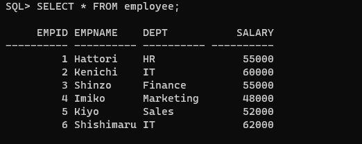

# Ex. No: 5 Creating Triggers using PL/SQL

### AIM: To create a Trigger using PL/SQL.

### Steps:
1. Create employee table with following attributes (empid NUMBER, empname VARCHAR(10), dept VARCHAR(10),salary NUMBER);
2. Create salary_log table with following attributes (log_id NUMBER GENERATED ALWAYS AS IDENTITY, empid NUMBER,empname VARCHAR(10),old_salary NUMBER,new_salary NUMBER,update_date DATE);
3. Create a trigger named as log_salary-update.
4. Inside the trigger block, Insert the values into the salary_log table whenever the salary is updated.
5. End the trigger.
6. Update the salary of an employee in employee table.
7. Whenever a salary is updated for the employee it must be logged into the salary_log table with old salary and new salary.
8. Display the employee table, salary_log table.

### Program:
### Create employee table
```sql
CREATE TABLE employee ( empid NUMBER,empname VARCHAR(10), dept VARCHAR(10),salary NUMBER);
```
### Create salary_log table
```sql
CREATE TABLE salary_log(log_id NUMBER GENERATED ALWAYS AS IDENTITY,empid NUMBER,
empname VARCHAR(10),old_salary NUMBER,new_salary NUMBER,update_date DATE);
```
### PLSQL Trigger code
```sql
CREATE OR REPLACE TRIGGER log_salary_update
AFTER UPDATE ON employee
FOR EACH ROW
BEGIN
  IF :OLD.salary <> :NEW.salary THEN
    INSERT INTO salary_log (empid, empname, old_salary, new_salary, update_date)
    VALUES (:OLD.empid, :OLD.empname, :OLD.salary, :NEW.salary, SYSDATE);
  END IF;
END;
/
```
### Update and Display Code
```sql
UPDATE employee SET salary = 55000 WHERE empid = 1;
SELECT * FROM employee;
SELECT * FROM salary_log;
```

### Output:





```
SUBMITTED BY :
NAME : SATHISH R
REGNO: 212222100048
```
### Result:
Thus,the Trigger is created using PL/SQL Successfully.
